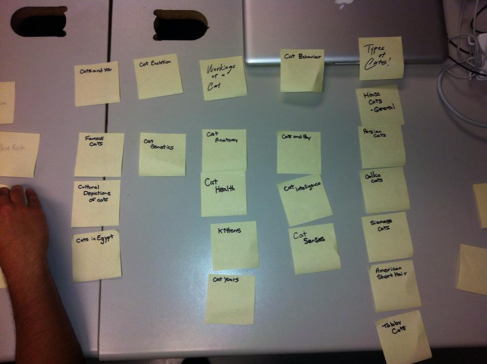
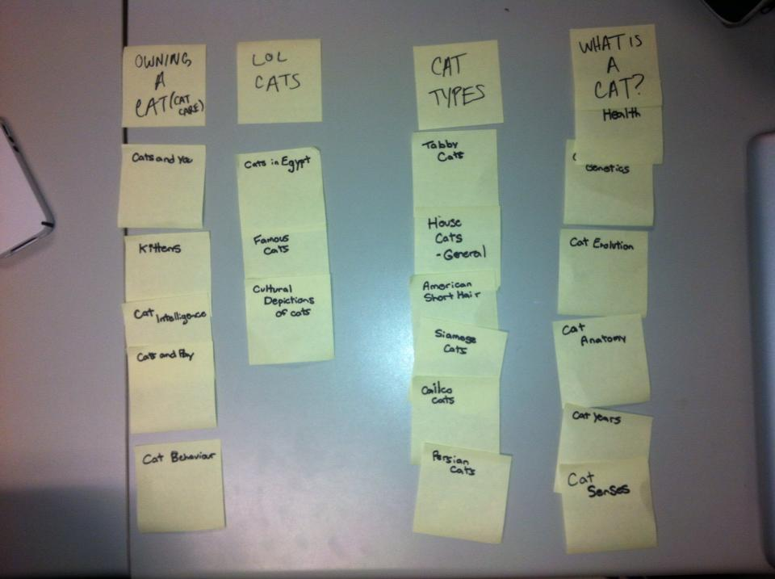

# Card sort report

The purpose of this card sort was to determine common navigation patterns and categories from the content of **House Cats of the World**.

## Specifics

The card sort was conducted by William Shaw on September 10th 2013 between the times of 8:00am and 11:00 with the following participants:

- Chris Mantil
- Seita Goto

### Cards

20 cards were used covering a broad range of applicable content for the website. The following topics were used as cards:

1. House Cats - General
2. Cat Health
3. Cat Senses
4. Cat Behaviour
5. Kittens
6. Cat Inteligence
7. Cultural Depictions of Cats
8. Cats in Egypt
9. Cat Years
10. Cats and Play
11. Cat Anatomy
12. Cat Genetics
13. Cats and You
14. Calico Cats
15. Persian Cats
16. Cat Evolution
17. Famous Cats
18. American Short Hair Cats
19. Siamese Cats
20. Tabby Cats

## Card sort results

*Card sort 1 by Seita Goto*

*Card sort 2 by Chris Mantil*

## Observations

- Did the participants have any common comments?
	- The most common comment that I got was if I had topic pre made topics I left it kind of open and purposely didn't give too much explaination. That way the card sorters can come to their own conclusions.
- Did they have questions that stood out?
	- They didn't really have any questions other then the comment listed above.
- Did they struggle with certain articles or topics?
	- Cats and Play was a subject that they struggled with it. I may need to be a bit more clear that the article is mostly dealing with how cats play.
- Did they find common groupings? Or were the groupings completely different?
	- The most common grouping was types of cats other then that they were completely different.
- Were some of the groupings completely unexpected?
	- LOL cats was a pretty fun and playful title. Im not sure if I will be able to use it though because it is not really that descriptive.
- Were the results similar to your expectations?
	- They were actually pretty similar
- How did you feel while watching them perform the task?
	- Nervous I had a certain way that I thought it should work out so its tough to see what other people would think.